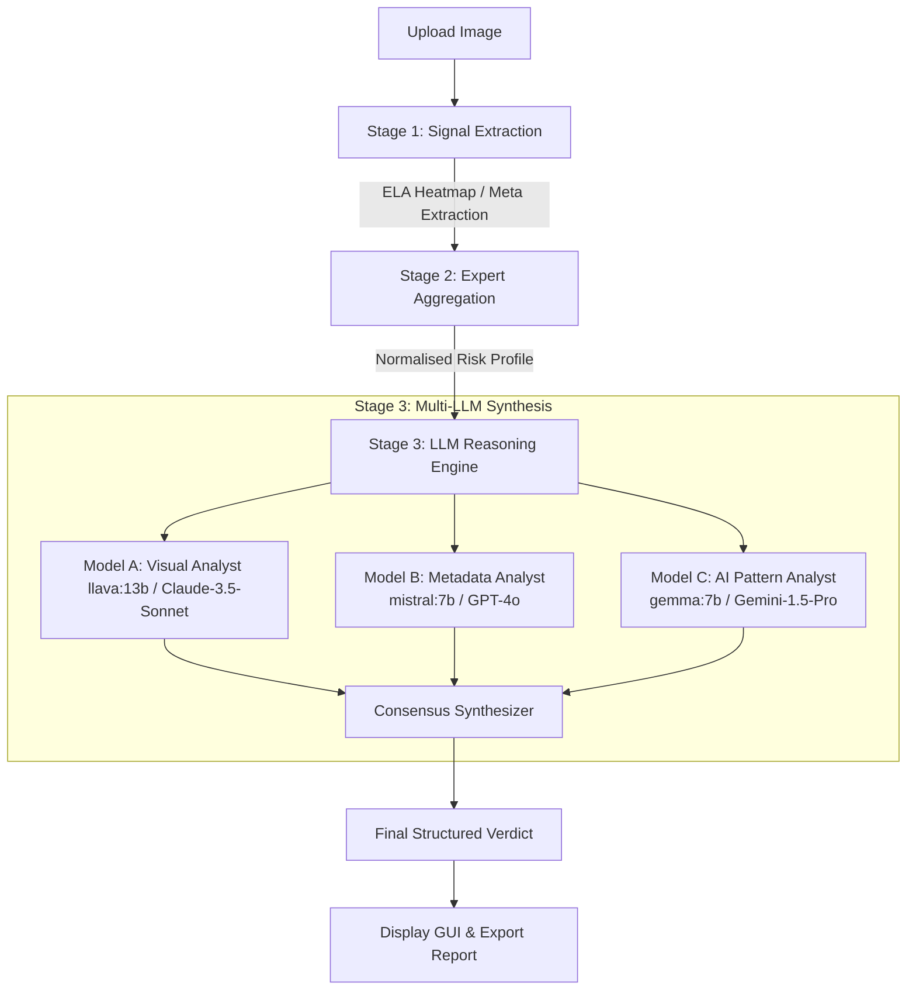

# 🛡️ ForensiX AI

> **Multi-Agent Desktop Digital Forensic & Image Authenticity Suite**  
> An advanced desktop application offering automated image manipulation detection, forensic signal analysis, and multi-agent LLM consensus reasoning in a sleek, dark-terminal aesthetic.

---

## 🔍 Overview

**ForensiX AI** is a state-of-the-art forensic analysis suite that combines traditional mathematical digital forensics with multi-agent Large Language Models (LLMs) to detect image tampering, metadata discrepancies, and AI-generated content (deepfakes).

Equipped with a dark-mode Tkinter desktop user interface, ForensiX AI automates the workflow of a forensic expert—extracting signals, validating timelines, assessing noise/compression inconsistencies, and generating structured forensic consensus reports.

---

## 🏗️ Architecture & Pipeline

ForensiX AI runs a comprehensive **3-Stage Forensic Pipeline**:



### 1. Stage 1: Signal Extraction
* **Error Level Analysis (ELA):** Computes resubmission compression differentials to locate areas with varying compression levels (indicating manipulation).
* **Metadata Parsing:** Decodes Exif, XMP, and system metadata tags to isolate timeline signals, camera details, and software footprints.

### 2. Stage 2: Expert Aggregation
* Normalizes float scores, ELA mean differences, standard deviations, and regional variances into human-readable severity tiers (`CLEAN`, `LOW_SUSPICION`, `MODERATE_SUSPICION`, `HIGH_SUSPICION`, `CRITICAL`).
* Builds a clean, unified context dictionary to feed into the reasoning engine.

### 3. Stage 3: Multi-LLM Reasoning Engine
Runs three specialist LLMs in parallel threads, each focusing on a distinct diagnostic angle:
* **Visual Anomaly Analyst (Model A):** Answers *WHERE was it changed?* (Ingests the image heatmap).
* **Metadata Timeline Analyst (Model B):** Answers *WHEN/HOW was it changed?* (Ingests Exif timelines).
* **AI Pattern Analyst (Model C):** Answers *Was AI generation used?* (Detects generative patterns).
* **Consensus Synthesizer:** Computes a weighted confidence score to yield a final verdict (`AUTHENTIC`, `SUSPICIOUS`, `TAMPERED`, `AI_ASSISTED_TAMPER`, or `FULLY_AI_GENERATED`).

---

## 🎨 Key UI Features

* 🖱️ **Drag-and-Drop Uploader:** Simply drag an image or browse to import.
* 📊 **Side-by-Side Viewer:** Interactively inspect the original image next to its live-generated ELA heatmap.
* ⚡ **Live Animated Progress:** Watch real-time analysis progress across the 3 pipeline steps.
* 📑 **Tabbed Forensic Reports:** Examine the analysis broken down into **Verdict**, **Signals**, **Metadata**, and **LLM Details** (showing raw prompts/reasoning).
* 🏷️ **Verdict Banner:** Color-coded alert banners instantly identify threat severity.
* 💾 **JSON Export:** Download fully structured, audit-ready JSON forensic reports.

---

## 🚀 Getting Started

### 📋 Prerequisites
* **Python 3.10+**
* **Tkinter** (usually comes standard with Python, or install via system package manager)
* **Ollama** (for local development/inference)

### 🔧 Installation

1. **Clone the repository:**
   ```bash
   git clone https://github.com/SriramKannan2005/Forensix-ai.git
   cd Forensix-ai
   ```

2. **Set up virtual environment:**
   ```bash
   python -m venv venv
   # On Windows:
   venv\Scripts\activate
   # On macOS/Linux:
   source venv/bin/activate
   ```

3. **Install dependencies:**
   ```bash
   pip install Pillow requests
   ```

---

## 🤖 Running the LLM Backend

### 1. Dev Mode (Local Ollama)
Ensure **Ollama** is installed and running on your local machine (`http://localhost:11434`).

Pull the default models used by the 3 specialists:
```bash
# Model A: Visual (multimodal)
ollama pull llava:13b

# Model B: Metadata
ollama pull mistral:7b

# Model C: AI Patterns
ollama pull gemma:7b
```

Run the application:
```bash
python forensix_ui.py
```

### 2. Production Mode (API Providers)
To switch to cloud providers (Anthropic Claude-3.5-Sonnet, OpenAI GPT-4o, Google Gemini-1.5-Pro), configure your API keys and set the environment variable:

```bash
# Set keys
export ANTHROPIC_API_KEY="your-key"
export OPENAI_API_KEY="your-key"
export GOOGLE_API_KEY="your-key"

# Enable prod mode
export FORENSIX_ENV="prod"

# Run UI
python forensix_ui.py
```

---

## 📁 Repository Structure

```
Forensix-ai/
│
├── forensix_ui.py         # Main Tkinter GUI application
├── schema.py              # Output data models & structures
│
├── aggregator/
│   └── aggregator.py      # Signal normalisation & context generator
│
├── llm/
│   ├── provider.py        # LLM driver (Ollama / Cloud APIs)
│   ├── prompts.py         # Specialized prompt templates
│   └── reasoning_engine.py# Multi-LLM parallel dispatch & synthesis
│
├── modules/
│   ├── image/             # Image analysis, ELA, and metadata extractors
│   ├── pdf/               # PDF forensic extractor (Roadmap)
│   └── video/             # Video/deepfake temporal analysis (Roadmap)
│
└── templates/             # HTML/other templates (if applicable)
```

---

## 🛡️ License

Distributed under the MIT License. See `LICENSE` for more information.
